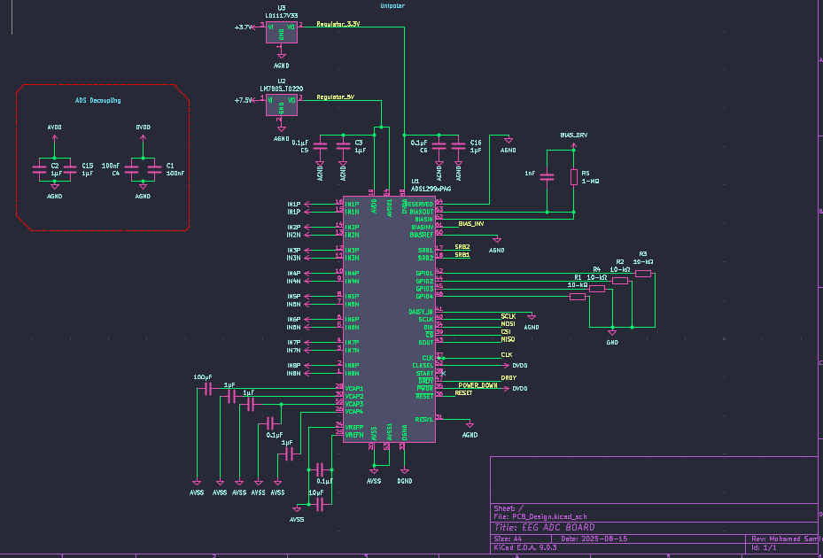

# August 15th: Schematic Design
Today, i have worked on the schematic design
## FootPrint

 
**Time spent: 3h**

# August 16th: Reverse Polarity Protection
Spent time researching and working on power supply schematic, validated the final version and assigned footprints.
**Time spent: 7h**